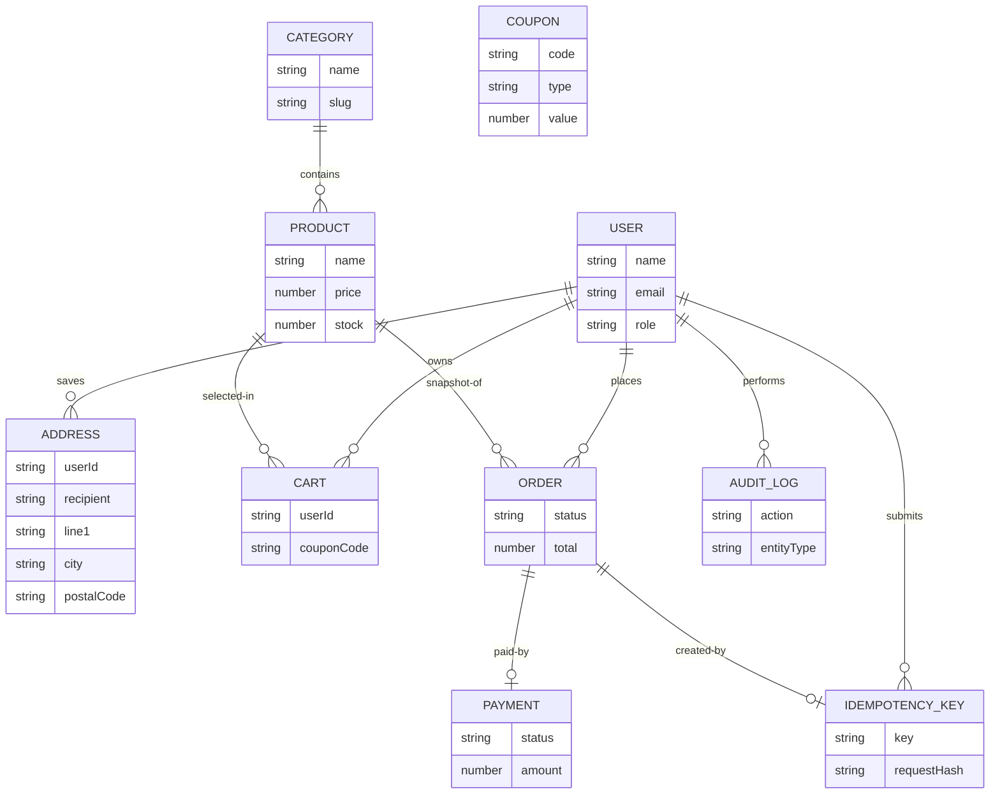

# Data model

```mermaid
erDiagram
  USER ||--o{ ADDRESS : saves
  USER ||--o{ CART : owns
  USER ||--o{ ORDER : places
  USER ||--o{ AUDIT_LOG : performs
  USER ||--o{ IDEMPOTENCY_KEY : submits
  CATEGORY ||--o{ PRODUCT : contains
  PRODUCT ||--o{ CART : selected-in
  PRODUCT ||--o{ ORDER : snapshot-of
  ORDER ||--o| PAYMENT : paid-by
  ORDER ||--o| IDEMPOTENCY_KEY : created-by
  USER { string name string email string role }
  ADDRESS { string userId string recipient string line1 string city string postalCode }
  CATEGORY { string name string slug }
  PRODUCT { string name number price number stock }
  CART { string userId string couponCode }
  ORDER { string status number total }
  PAYMENT { string status number amount }
  COUPON { string code string type number value }
  IDEMPOTENCY_KEY { string key string requestHash }
  AUDIT_LOG { string action string entityType }
```

Address records belong to a user and are stored in their own collection. Orders embed a snapshot of the selected address so later address edits do not change past orders.
